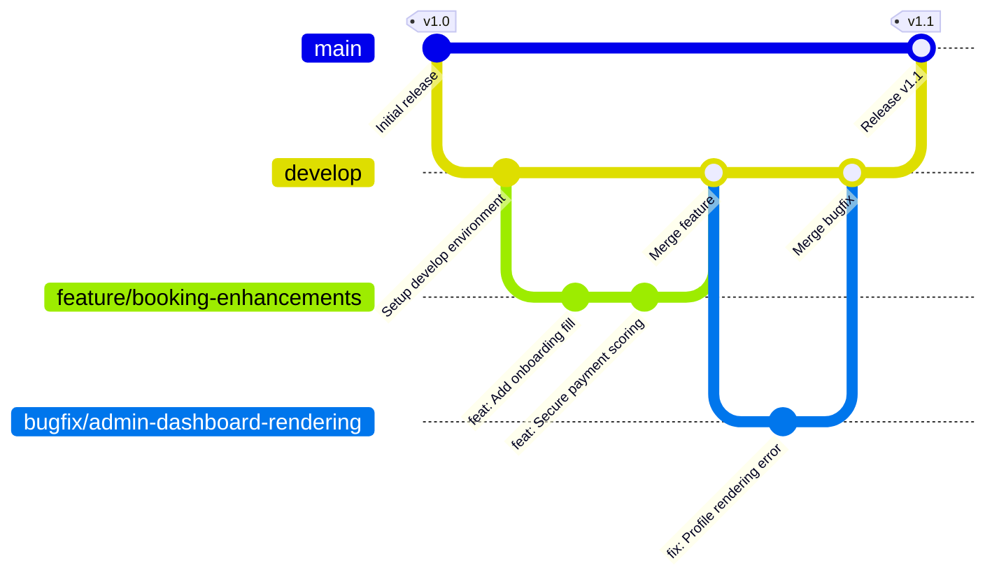
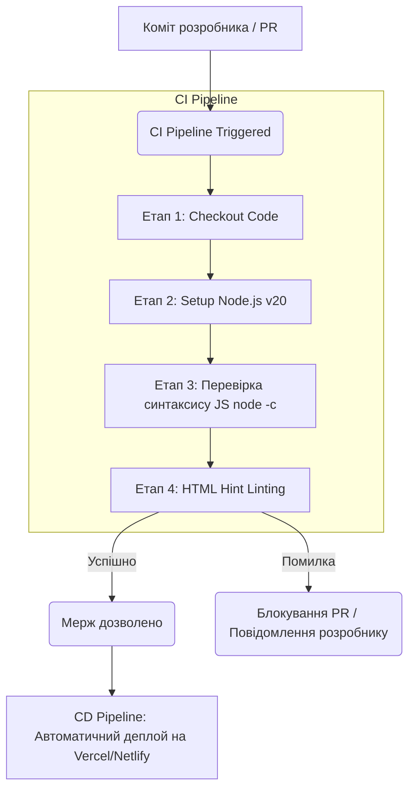
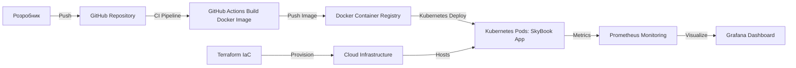
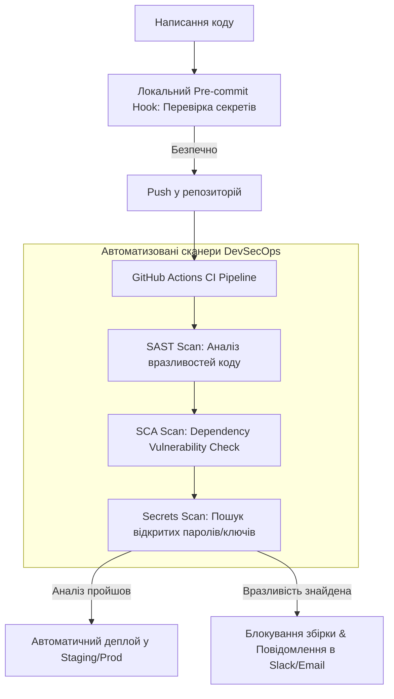

# Лабораторна робота №13-14
**Тема**: Організація процесу командної розробки програмного продукту з використанням DevOps та Git-практик
**Виконала**: студентка 3-го курсу групи КП-31 Криворучко Вікторія Миколаївна
**Дисципліна**: Технології створення програмних продуктів (ТСПП)

---

## Завдання 1. Створення та структура Git-репозиторію проєкту

Для організації процесу командної розробки та автоматизації розгортання було ініціалізовано локальний Git-репозиторій для проєкту SkyBook за допомогою командного рядка:

```bash
# Ініціалізація репозиторію
git init

# Додавання всіх файлів до індексу Git
git add .

# Створення першого базового коміту
git commit -m "Initial commit: SkyBook project codebase, documentation and reports"
```

### Структура проєкту у репозиторії:
* **`.github/workflows/ci.yml`** — конфігураційний файл CI-конвеєра для GitHub Actions.
* **`.gitignore`** — конфігурація файлів та папок, які не повинні відстежуватися системою Git (наприклад, `node_modules/`, тимчасові файли ОС, лог-файли).
* **`README.md`** — документація проєкту з описом можливостей, інструкціями по запуску та описом структури.
* **`index.html`** — розмітка та модальні форми інтерфейсу SkyBook.
* **`style.css`** — таблиці стилів вебдодатка, включаючи медіа-стилі для друку квитків.
* **`app.js`** — ядро JavaScript логіки, що містить імітацію бази даних (`localStorage`) та бізнес-процесів.
* **`package.json`** — файл конфігурації Node.js зі скриптом запуску сервера розробника.

---

## Завдання 2. Організація методології Git Flow

Для командної розробки було обрано класичну методологію **Git Flow**, яка забезпечує ізоляцію стабільного коду від нових експериментальних фіч.

Локально було створено таку структуру гілок:
* `main` — стабільний релізний код.
* `develop` — основна гілка інтеграції розробки.
* `feature/booking-enhancements` — гілка розробки нової функціональності.
* `bugfix/admin-dashboard-rendering` — гілка для оперативного виправлення помилок.

### Схема життєвого циклу гілок у Git Flow:



---

## Завдання 3. Порівняння методологій розробки

У сучасній практиці DevOps використовуються дві основні стратегії розгалуження: **Git Flow** та **Trunk Based Development (TBD)**. 

### Порівняльна таблиця методологій:

| Критерій порівняння | Git Flow | Trunk Based Development (TBD) |
| :--- | :--- | :--- |
| **Кількість тривалих гілок** | Дві (`main` та `develop`) | Одна (`main` або `trunk`) |
| **Життєвий цикл гілок** | Довгий (feature-гілки живуть тижнями) | Дуже короткий (гілки зливаються протягом дня) |
| **Складність злиття коду** | Висока (виникають великі конфлікти злиття) | Низька (завдяки частим дрібним інтеграціям) |
| **Частота релізів** | Низька (за розкладом релізів, наприклад раз на місяць) | Дуже висока (декілька разів на день) |
| **Підхід до тестування** | Релізи тестуються на етапі `release branch` | Автоматичне тестування кожного коміту (CI/CD) |
| **Підходить для команд** | Великі команди зі строгими циклами релізів | Команди з високим рівнем автоматизації та CI/CD |

* **Trunk Based Development (TBD)** базується на трьох принципах:
  1. *Small commits* — зміни розбиваються на мікро-коміти, які легше перевіряти.
  2. *Frequent integration* — інтеграція в основну гілку відбувається щонайменше 1-2 рази на день.
  3. *Short-lived branches* — локальні гілки живуть не більше 24 годин, що запобігає «конфліктному пеклу» при злитті.

---

## Завдання 4 & 5. Робота з командами та Pull Request Workflow

Для симуляції процесу розробки нового компонента було виконано такий ланцюжок дій:
1. Перехід на гілку розробки фічі: `git checkout feature/booking-enhancements`
2. Створення коміту з новими правками: `git commit -am "feat: Add booking process security and UX enhancements"`
3. Злиття фічі у гілку інтеграції розробки: 
   ```bash
   git checkout develop
   git merge feature/booking-enhancements
   ```

### Опис Pull Request Workflow на GitHub:
1. Розробник відправляє гілку у віддалений репозиторій: `git push origin feature/booking-enhancements`
2. На сторінці репозиторію натискається кнопка **Compare & pull request**.
3. Заповнюються поля PR:
   - **Title**: Зрозуміла назва змін.
   - **Description**: Опис доданого функціоналу, посилання на пов'язану проблему (Linked Issue #12).
   - **Screenshots**: Додаються графічні знімки екрана для верифікації UI-змін.
4. Після проходження автоматизованих тестів (GitHub Actions) та схвалення від колег (Code Review), виконується операція **Squash and Merge** для злиття змін у `develop`.

---

## Завдання 6. Процес перевірки коду (Code Review Process)

Code Review є обов'язковим етапом перед злиттям коду. Під час перевірки коду у файлі [app.js](file:///f:/Jobs/Навчання/3 курс/2 семестр/ТСПП/app.js) оцінювалися такі параметри:
1. **Readability (Читабельність)**: Код структуровано на логічні блоки (БД, Навігація, Пошук, Бронювання, Авторизація). Присутні коментарі українською мовою.
2. **Architecture (Архітектура)**: Додаток побудовано за концепцією SPA (Single Page Application). Замість застарілого клонування кнопок застосовано пряму прив'язку подій до живих елементів DOM, що виправляє баг навігації.
3. **Security (Безпека)**: Реалізовано імітаційний алгоритм фрод-моніторингу транзакцій. Для безпеки паролі користувачів перевіряються через локальну базу даних без відображення у відкритому коді. Додано перевірку на пусті або некоректні серії паспортів пасажирів.
4. **Naming (Іменування)**: Змінні та функції іменовано за стандартом `camelCase` (наприклад, `renderPassengerDashboard`, `btnElevateAdmin`). DOM-елементи іменовано через `kebab-case` (`#btn-elevate-admin`, `#admin-secret-key`).
5. **Formatting (Форматування)**: Відступи в 4 пробіли, відсутні невикористані змінні, файли закінчуються пустим рядком.

---

## Завдання 7 & 8. Конвейєр CI/CD та налаштування автоматизації

Для автоматичного тестування кожної зміни у проєкті налаштовано **GitHub Actions**.

### Конфігурація CI-конвеєра (`.github/workflows/ci.yml`):
Файл описує процес автоматичного запуску на віртуальній машині Ubuntu при кожному коміті або Pull Request у гілки `main` та `develop`:
1. **Checkout code** — клонування актуального коду з репозиторію.
2. **Set up Node.js** — запуск середовища виконання Node.js версії 20.
3. **Syntax Check** — виконання команди `node -c app.js` для перевірки синтаксису JavaScript.
4. **Static Analysis** — перевірка HTML-файлів за допомогою бібліотеки `htmlhint` на валідність структури тегів.

### Схема CI/CD конвеєра:



---

## Завдання 9. Автоматизація DevOps (DevOps Automation)

DevOps архітектура автоматизує життєвий цикл додатку від розробки до моніторингу працездатності в реальному часі на серверах.

### Ключові компоненти DevOps архітектури:
1. **Docker (Контейнеризація)**: Додаток упаковується у легковажний образ Docker разом із залежностями та статичним вебсервером (наприклад, Nginx).
2. **Kubernetes (Оркестрація)**: Забезпечує автоматичне масштабування контейнерів додатку в хмарі, відновлення контейнерів у разі падіння (Self-healing) та балансування навантаження.
3. **Infrastructure as Code (IaC)**: Опис серверної інфраструктури (віртуальні машини, мережі, балансувальники) за допомогою коду (Terraform).
4. **Monitoring (Моніторинг)**: Збір логів додатку та метрик навантаження на процесор/пам'ять за допомогою стеків Prometheus та Grafana.

### Діаграма DevOps архітектури:



---

## Завдання 10. Інтеграція безпеки (DevSecOps Flow)

**DevSecOps** — це підхід, який вбудовує практики безпеки безпосередньо у конвеєр автоматизації розробки (CI/CD) на кожному етапі, а не тестує її перед самим релізом.

### Процеси безпеки:
* **SAST (Static Application Security Testing)** — автоматичне сканування вихідного коду на вразливості (XSS, SQL Injection).
* **Dependency Check (SCA)** — сканування використовуваних сторонніх NPM-бібліотек на наявність відомих вразливостей.
* **Secret Scanning** — перевірка коду на випадковий витік секретних даних (API-ключі, паролі до баз даних, приватні ключі SSH).
* **Security Monitoring** — постійний аудит логів авторизацій та транзакцій у реальному часі.

### Діаграма DevSecOps Flow:


